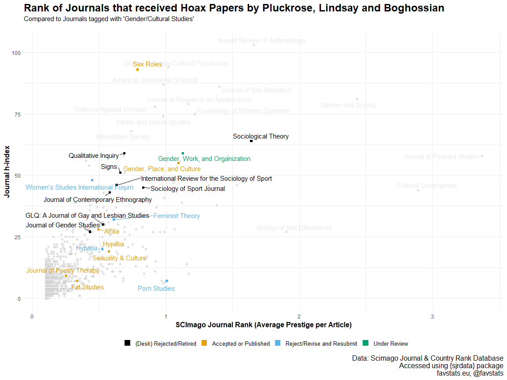
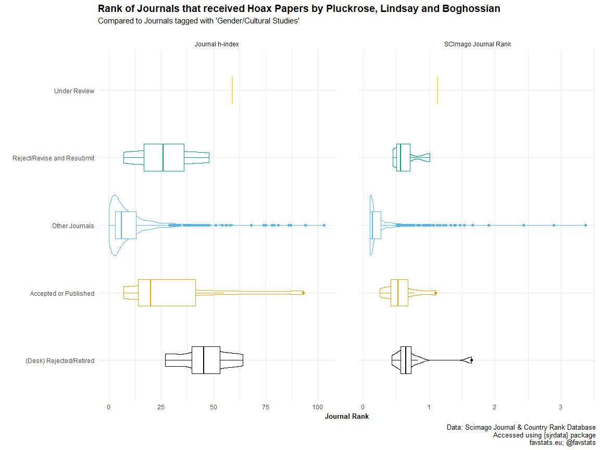

Pluckrose et al. Hoax Papers
================
Fabio Votta
4.10.2018

Here I want to analyze the Rankings of Journals that received hoax
papers by Boghossian, Lindsay and Pluckrose. You can read about the
story
[here](https://www.motherjones.com/kevin-drum/2018/10/cultural-studies-is-the-target-of-another-hoax-and-this-one-stings/)
and
[here](https://areomagazine.com/2018/10/02/academic-grievance-studies-and-the-corruption-of-scholarship/)
in their own words.

## Packages

Loading in some packages.

``` r
# Install these packages if you don't have them yet
# devtools::install_github("favstats/tidytemplate")
# install.packages("pacman")

pacman::p_load(tidyverse, rvest, sjrdata, janitor, ggthemes)
```

## Load Data

Some quick webscraping to get the details on the papers created by
Pluckrose et
al.

``` r
areo_html <- read_html("https://areomagazine.com/2018/10/02/academic-grievance-studies-and-the-corruption-of-scholarship/")

journals <- areo_html %>% 
  html_nodes("em:nth-child(1) a") %>% 
  html_text()

titles <- areo_html %>% 
  html_nodes("p") %>% 
  html_text() %>% 
  .[str_detect(., "Title: |Title. |Rubbing One Out: ")]  

short_titles <- areo_html %>% 
  html_nodes("p:nth-child(309) strong , hr+ p strong , p:nth-child(67) strong") %>% 
  html_text() %>% 
  .[!(str_detect(., "Part"))] 


status <- areo_html %>% 
  html_nodes("p") %>% 
  html_text() %>% 
  .[str_detect(., "Status: ")]  


areo_data <- tibble(journals, titles, short_titles, status) %>% 
  mutate(titles = str_remove(titles, "Title: |Title. ")) %>% 
  mutate(status = str_remove(status, "Status: "))

tidytemplate::save_it(areo_data)
```

## Scimago Journal & Country Rank Data

Next, I combine the article data with the [Scimago Journal & Country
Rank Database](https://www.scimagojr.com/) to get Journal Rankings.

### Merging and Overview

``` r
sj_data <- sjrdata::sjr_journals %>% 
  filter(year == 2017) %>% 
  rename(journals = title) %>% 
  ### renaming journals so they match the article
  mutate(journals = case_when(
    journals == "Sexuality and Culture" ~ "Sexuality & Culture",
    journals == "Affilia - Journal of Women and Social Work" ~ "Affilia",
    journals == "Women's Studies International Forum" ~ "Women’s Studies International Forum",
    journals == "Gender, Work and Organization" ~ "Gender, Work, and Organization",
    journals == "Glq" ~ "GLQ: A Journal of Gay and Lesbian Studies",
    T ~ journals
  )) %>% 
  full_join(areo_data) 
```

Let’s take a look the papers and journals, sorted by journal rank. There
are two metrics in the SJR Database that we’ll focus on:

  - **SCImago Journal Rank (SJR indicator)**

It expresses the average number of weighted citations received in the
selected year by the documents published in the selected journal in the
three previous years, –i.e. weighted citations received in year X to
documents published in the journal in years X-1, X-2 and X-3. [See
detailed description of SJR
(PDF)](https://www.scimagojr.com/SCImagoJournalRank.pdf).

  - **H Index**

The h index expresses the journal’s number of articles (h) that have
received at least h citations. It quantifies both journal scientific
productivity and scientific impact and it is also applicable to
scientists, countries, etc. [(see H-index wikipedia
definition)](http://en.wikipedia.org/wiki/Hirsch_number).

``` r
sj_data %>% 
  filter(!is.na(status)) %>% 
  select(titles, status, journals, rank, sjr, h_index, categories) %>% 
  arrange(desc(sjr)) %>% 
  knitr::kable()
```

| titles                                                                                                                                                              | status                                                 | journals                                        |  rank |   sjr | h\_index | categories                                                                                                                                                |
| :------------------------------------------------------------------------------------------------------------------------------------------------------------------ | :----------------------------------------------------- | :---------------------------------------------- | ----: | ----: | -------: | :-------------------------------------------------------------------------------------------------------------------------------------------------------- |
| Rubbing One Out: Defining Metasexual Violence of Objectification Through Nonconsensual Masturbation                                                                 | Rejected after peer review                             | Sociological Theory                             |  1966 | 1.641 |       64 | Sociology and Political Science (Q1)                                                                                                                      |
| Strategies for Dealing with Cisnormative Discursive Aggression in the Workplace: Disruption, Criticism, Self-Enforcement, and Collusion                             | Under review                                           | Gender, Work, and Organization                  |  3683 | 1.129 |       59 | Gender Studies (Q1); Organizational Behavior and Human Resource Management (Q1)                                                                           |
| Human Reactions to Rape Culture and Queer Performativity in Urban Dog Parks in Portland, Oregon                                                                     | Accepted & Published                                   | Gender, Place, and Culture                      |  3860 | 1.096 |       55 | Arts and Humanities (miscellaneous) (Q1); Cultural Studies (Q1); Demography (Q1); Gender Studies (Q1)                                                     |
| Agency as an Elephant Test for Feminist Porn: Impacts on Male Explicit and Implicit Associations about Women in Society by Immersive Pornography Consumption        | Revise and resubmit.                                   | Porn Studies                                    |  4321 | 1.008 |        7 | Cultural Studies (Q1); Gender Studies (Q1); Social Psychology (Q1)                                                                                        |
| “Pretty Good for a Girl”: Feminist Physicality and Women’s Bodybuilding                                                                                             | Retired.                                               | Sociology of Sport Journal                      |  5576 | 0.832 |       45 | Physical Therapy, Sports Therapy and Rehabilitation (Q1); Sociology and Political Science (Q1); Orthopedics and Sports Medicine (Q2); Sports Science (Q2) |
| An Ethnography of Breastaurant Masculinity: Themes of Objectification, Sexual Conquest, Male Control, and Masculine Toughness in a Sexually Objectifying Restaurant | Accepted, Published                                    | Sex Roles                                       |  5939 | 0.789 |       93 | Gender Studies (Q1); Developmental and Educational Psychology (Q2); Social Psychology (Q2)                                                                |
| Masculinity and the Others Within: A Schizoethnographic Approach to Autoethnography                                                                                 | Retired.                                               | Qualitative Inquiry                             |  6878 | 0.691 |       59 | Anthropology (Q1); Social Sciences (miscellaneous) (Q1)                                                                                                   |
| Rebraiding Masculinity: Redefining the Struggle of Women Under the Domination of the Masculinity Trinity                                                            | Retired.                                               | Signs                                           |  7164 | 0.660 |       51 | Gender Studies (Q1); Arts and Humanities (miscellaneous) (Q2)                                                                                             |
| Grappling with Hegemonic Masculinity: The Roles of Masculinity and Heteronormativity in Brazilian Jiu Jitsu                                                         | Retired.                                               | International Review for the Sociology of Sport |  7478 | 0.632 |       46 | Social Sciences (miscellaneous) (Q1); Sociology and Political Science (Q1); Sports Science (Q3)                                                           |
| Super-Frankenstein and the Masculine Imaginary: Feminist Epistemology and Superintelligent Artificial Intelligence Safety Research                                  | Revise and Resubmit                                    | Feminist Theory                                 |  7748 | 0.611 |       32 | Gender Studies (Q1)                                                                                                                                       |
| Self-Reflections on Self-Reflections: An Autoethnographic Defense of Autoethnography                                                                                | Retired.                                               | Journal of Contemporary Ethnography             |  8142 | 0.580 |       43 | Anthropology (Q1); Language and Linguistics (Q1); Sociology and Political Science (Q2); Urban Studies (Q2)                                                |
| Going in Through the Back Door: Challenging Straight Male Homohysteria and Transphobia through Receptive Penetrative Sex Toy Use                                    | Accepted, Published                                    | Sexuality & Culture                             |  8214 | 0.574 |       19 | Cultural Studies (Q1); Gender Studies (Q1)                                                                                                                |
| Queering Plato: Plato’s Allegory of the Cave as a Queer-Theoretic Emancipatory Text on Sexuality and Gender                                                         | Desk rejected after several months and retired.        | GLQ: A Journal of Gay and Lesbian Studies       |  8826 | 0.530 |       30 | Cultural Studies (Q1); Gender Studies (Q2)                                                                                                                |
| When the Joke Is on You: A Feminist Perspective on How Positionality Influences Satire                                                                              | Accepted                                               | Hypatia                                         |  8897 | 0.525 |       20 | Philosophy (Q1); Gender Studies (Q2)                                                                                                                      |
| The Progressive Stack: An Intersectional Feminist Approach to Pedagogy                                                                                              | 3 Reject and Resubmit decisions                        | Hypatia                                         |  8897 | 0.525 |       20 | Philosophy (Q1); Gender Studies (Q2)                                                                                                                      |
| Our Struggle is My Struggle: Solidarity Feminism as an Intersectional Reply to Neoliberal and Choice Feminism                                                       | Accepted                                               | Affilia                                         |  9295 | 0.496 |       28 | Gender Studies (Q2); Social Sciences (miscellaneous) (Q2); Social Work (Q2)                                                                               |
| Stars, Planets, and Gender: A Framework for a Feminist Astronomy                                                                                                    | Revise and Resubmit                                    | Women’s Studies International Forum             | 10077 | 0.448 |       48 | Development (Q2); Education (Q2); Law (Q2); Sociology and Political Science (Q2)                                                                          |
| Hegemonic Academic Bullying: The Ethics of Sokal-style Hoax Papers on Gender Studies                                                                                | Retired.                                               | Journal of Gender Studies                       | 10321 | 0.434 |       27 | Arts and Humanities (miscellaneous) (Q2); Gender Studies (Q2); Social Sciences (miscellaneous) (Q2)                                                       |
| Who Are They to Judge?: Overcoming Anthropometry and a Framework for Fat Bodybuilding                                                                               | Accepted, Published                                    | Fat Studies                                     | 12401 | 0.336 |        7 | Cultural Studies (Q1); Anthropology (Q2); Gender Studies (Q2); Health (social science) (Q3); Nutrition and Dietetics (Q3); Social Psychology (Q3)         |
| Moon Meetings and the Meaning of Sisterhood: A Poetic Portrayal of Lived Feminist Spirituality                                                                      | Accepted (without any requested revisions or comments) | Journal of Poetry Therapy                       | 14943 | 0.255 |        9 | Clinical Psychology (Q3); Rehabilitation (Q3)                                                                                                             |
| My Struggle to Dismantle My Whiteness: A Critical-Race Examination of Whiteness from within Whiteness                                                               | Rejected after peer review                             | Sociology of Race and Ethnicity                 |    NA |    NA |       NA | NA                                                                                                                                                        |

One limitation becomes notable at the end of the table: The journal
[Sociology of Race and
Ethnicity](https://uk.sagepub.com/sites/default/files/upm-binaries/93165_SRE_Sociology_of_Race_and_Ethnicity_Rate_Card_2018.pdf)
is a very new journal and has no ranking yet. So the paper that was
submitted here is not included in the following plot.

It’s good to have an overview of all the created papers. But how do the
journals that they were submitted to rank in comparison to other
journals in the field? That is what I attempt to show next.

First, I filter the dataset to only include the journals that received
hoax papers and that are tagged as belonging to *Gender/Cultural
Studies*. Next, I collapse the (pending) status of the papers into the
following categories:

1.  Accepted or Published

2.  Reject/Revise and Resubmit

3.  (Desk) Rejected/Retired

4.  Under Review

<!-- end list -->

``` r
sj_data <- sj_data %>%  
  filter(str_detect(categories, "Gender Studies|Cultural Studies") | !(is.na(status))) %>% 
  mutate(status = case_when(
    str_detect(status, "Published") ~ "Accepted or Published",
    str_detect(status, "Reject and Resubmit") ~ "Reject/Revise and Resubmit",
    str_detect(status, "Revise and .esubmit") ~ "Reject/Revise and Resubmit",
    str_detect(status, "Accepted") ~ "Accepted or Published",
    str_detect(status, ".ejected") ~ "(Desk) Rejected/Retired",
    str_detect(status, "review") ~ "Under Review",
    str_detect(status, "Retired") ~ "(Desk) Rejected/Retired",
    T ~ "Other Journals"
  )) 

sj_data %>% 
  janitor::tabyl(status) %>% 
  knitr::kable()
```

| status                     |   n |   percent |
| :------------------------- | --: | --------: |
| (Desk) Rejected/Retired    |   9 | 0.0091743 |
| Accepted or Published      |   7 | 0.0071356 |
| Other Journals             | 960 | 0.9785933 |
| Reject/Revise and Resubmit |   4 | 0.0040775 |
| Under Review               |   1 | 0.0010194 |

Now, it’s time to take a look at how the journals that received hoax
papers compare to other journals in the field.

### Scatterplot

``` r
sj_data %>% 
  filter(status != "Other Journals") %>% 
  ggplot(aes(h_index, sjr, color = status)) +
  ## grey background
  geom_point(data = sj_data %>% 
               filter(status == "Other Journals"), 
             color = "lightgrey", alpha = 0.6) +
  ggrepel::geom_text_repel(data = sj_data  %>% 
                             filter(status == "Other Journals") %>% 
                             filter(h_index >= 60 | sjr >= 1.7), 
                           aes(label = journals),  show.legend = F, 
                                  color = "lightgrey", alpha = 0.5) +
  geom_point(size = 1.5, shape = 15) +
  scale_color_manual("", values = c(ggthemes::colorblind_pal()(5))) +
  coord_flip() +
  theme_minimal() +
  ggrepel::geom_text_repel(data = sj_data  %>% 
                             filter(status != "Other Journals"), #%>% 
                           aes(label = journals), show.legend = F, force = 4) +
  labs(y = "SCImago Journal Rank (Average Prestige per Article)", 
       x = "Journal h-index", 
       title = "Rank of Journals that received Hoax Papers by Pluckrose, Lindsay and Boghossian",
       subtitle = "Compared to Journals tagged with 'Gender/Cultural Studies'\n",
       caption = "Data: Scimago Journal & Country Rank Database\nAccessed using {sjrdata} package\nfavstats.eu; @favstats") +
  theme(
    legend.text = element_text(size = 10),
    axis.title = element_text(size = 12, face = "bold"),
    plot.title = element_text(size = 18, face = "bold", hjust = 0),
    plot.caption = element_text(size = 12),
    legend.position = "bottom",
    legend.title = element_text(size = 10), 
    #axis.ticks.length = unit(3, "cm")
    ) +
  guides(color = guide_legend(override.aes = list(size = 4)))
```



``` r
tidytemplate::ggsave_it(gender_studies, width = 12, height = 9)
```

*Now, how bad is the damage?* Well, the most notable and impactful
journals that published or accepted hoax papers were **Sex Roles** (with
the paper *“An Ethnography of Breastaurant Masculinity”*) and **Gender,
Place, and Culture** (with the paper *“Human Reactions to Rape Culture
and Queer Performativity in Urban Dog Parks in Portland, Oregon”*).
Other than that, quite a few of the journals that accepted or published
hoax papers are found in the lower left quadrant with comparitively low
impact.

### Boxplot

Let’s compare the journal rankings directly now, with the help of box-
and violinplots.

``` r
sj_data %>% 
  rename(`SCImago Journal Rank` = sjr,
         `Journal h-index` = h_index) %>% 
  select(status, `SCImago Journal Rank`, `Journal h-index`) %>% 
  gather(key, value, -status) %>% 
  ggplot(aes(status, value, color = status)) +
  geom_violin() +
  geom_boxplot(width = 0.4) +
  scale_color_manual("", values = c(ggthemes::colorblind_pal()(5))) +
  coord_flip() +
  theme_minimal() +
  facet_wrap(~key, scales = "free_x") +
  labs(y = "Journal Rank", 
       x = "", 
       title = "Rank of Journals that received Hoax Papers by Pluckrose, Lindsay and Boghossian",
       subtitle = "Compared to Journals tagged with 'Gender/Cultural Studies'\n",
       caption = "Data: Scimago Journal & Country Rank Database\nAccessed using {sjrdata} package\nfavstats.eu; @favstats") +
  theme(
    panel.spacing = unit(2.4, "lines"),
    legend.text = element_text(size = 8),
    axis.title = element_text(size = 10, face = "bold"),
    plot.title = element_text(size = 14, face = "bold", hjust = 0),
    plot.caption = element_text(size = 10),
    legend.position = "bottom",
    legend.title = element_text(size = 8), 
    ) +
  guides(color = F)
```



``` r
tidytemplate::ggsave_it(gender_studies_boxplots, width = 10, height = 6)
```

Some interesting patterns are revealed here. Seems like journals that
rejected papers were *somewhat better ranked* than those that accepted
hoax papers (more evident with the Journal h-index). It’s also worth
noting, that the majority of the other journals in the field of
Gender/Cultural Studies do rank considerably lower than those that
Pluckrose et al. managed to get their papers published in.

## So what are some conclusions to draw from this?

What Pluckrose et al. accomplished by getting seven of their papers
accepted in peer-reviewed journals is definetely remarkable. Reading
through the papers, one can’t really come away and think that this is
anything less than sloppy. The journals that fell for the hoax should
look into making the editorial board clean up their standards. As a
quant guy, I particularly cringed at the “statistical analysis” in the
*“Agency as an Elephant Test for Feminist Porn”* paper.

Having said that, I think the conclusions that the authors draw from
their hoax project are very far fetched. [In the video they published
along with the
papers](https://www.youtube.com/watch?v=kVk9a5Jcd1k&feature=youtu.be),
they say:

> “\[…\] corruption is pervasive among many disciplines including
> women’s and gender studies, feminist studies, race studies,
> sexuality studies, fat studies, queer studies, cultural studies and
> sociology.”

To claim that entire fields of studies are “corrupted” because of this
incident seems unwarranted to me.

There are enough journals that rejected the hoaxes and papers in other
[fields are retracted all the time](https://retractionwatch.com/)
because of fraud or other shortcomings. As an example, [this
video](https://www.youtube.com/watch?v=wLlA1w4OZWQ) details an egregious
case in a nanoscience journal where images were blatantly forged,
something that would have been obvious to any non-nanoscientist. I
understand that this might come off as an attempt to whatabout the issue
away. But nobody would come up with the idea that **corruption is
pervasive** in nanoscience because of this very blatant case of forgery
and I don’t believe anyone should think the same of gender studies and
related fields.
